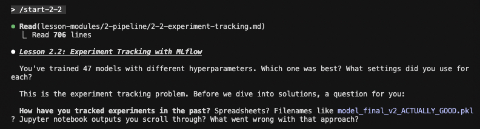

# Interactive MLOps Course with Claude Code

Learn production machine learning by building and deploying a real sentiment classifier. This hands-on course uses Claude Code as your AI learning partner, guiding you through the complete MLOps lifecycle.

## What You'll Build

A production-ready sentiment classifier for customer feedback analysis. You'll take it from a local script to a fully deployed, monitored API with CI/CD.

```
                                YOUR LEARNING JOURNEY

    Level 1               Level 2               Level 3               Level 4
   Foundations            Pipeline             Deployment           Production

   ┌─────────┐          ┌─────────┐          ┌─────────┐          ┌─────────┐
   │  Local  │          │   DVC   │          │ FastAPI │          │  CI/CD  │
   │  Model  │────────▶ │ + MLflow│────────▶ │   API   │────────▶ │ Pipeline│
   └─────────┘          └─────────┘          └─────────┘          └─────────┘
        │                    │                    │                    │
        ▼                    ▼                    ▼                    ▼
   ┌─────────┐          ┌─────────┐          ┌─────────┐          ┌─────────┐
   │ Docker  │          │  Tests  │          │  Cloud  │          │  Drift  │
   │ Package │          │         │          │ Deploy  │          │ Monitor │
   └─────────┘          └─────────┘          └─────────┘          └─────────┘
```

## Prerequisites

- Python proficiency (comfortable with classes, modules, virtual environments)
- Basic ML concepts (sklearn, pandas, train/test splits)
- Command line familiarity
- Docker installed
- Claude Code CLI installed ([installation guide](https://docs.anthropic.com/en/docs/claude-code))

## Getting Started

1. Clone this repository:
   ```bash
   git clone https://github.com/sshtomar/ai-pair-programming-mlops.git
   cd ai-pair-programming-mlops
   ```

2. Start Claude Code:
   ```bash
   claude
   ```

3. Begin the first lesson:
   ```
   /start-1-1
   ```

## Course Structure

### Level 1: Foundations
| Lesson | Topic | What You'll Learn |
|--------|-------|-------------------|
| 1-1 | Welcome & Setup | Environment setup, course navigation |
| 1-2 | MLOps Principles | Why 87% of ML projects fail, the 5 pillars of MLOps |
| 1-3 | Your First Model | Build a sentiment classifier with production structure |
| 1-4 | Packaging for Production | Dockerize your ML application |

### Level 2: The ML Pipeline
| Lesson | Topic | What You'll Learn |
|--------|-------|-------------------|
| 2-1 | Data Versioning | DVC setup, linking data to code versions |
| 2-2 | Experiment Tracking | MLflow for parameters, metrics, artifacts |
| 2-3 | Model Registry | Model lifecycle, staging to production workflows |
| 2-4 | Testing ML Code | Unit tests, integration tests, behavioral testing |

### Level 3: Deployment
| Lesson | Topic | What You'll Learn |
|--------|-------|-------------------|
| 3-1 | Model Serving Options | Batch vs real-time, latency vs throughput |
| 3-2 | Building an API | FastAPI endpoints, validation, health checks |
| 3-3 | Containerization Deep Dive | Multi-stage builds, optimization, secrets |
| 3-4 | Deploying to Cloud | Cloud Run deployment, auto-scaling |

### Level 4: Production Operations
| Lesson | Topic | What You'll Learn |
|--------|-------|-------------------|
| 4-1 | CI/CD for ML | GitHub Actions, automated testing, deployment gates |
| 4-2 | Monitoring & Observability | System vs model metrics, logging, alerting |
| 4-3 | Model Drift & Retraining | Drift detection, retraining triggers |
| 4-4 | Capstone | End-to-end review, architecture assessment |

## Commands

Run these in Claude Code:

| Command | Description |
|---------|-------------|
| `/start-X-Y` | Begin lesson X.Y (e.g., `/start-1-1`) |
| `/status` | Check your course progress |
| `/check` | Verify your exercise solution |
| `/hint` | Get a hint for the current exercise |
| `/review-code` | Get ML engineer code review |
| `/review-deployment` | Get SRE deployment review |
| `/help-mlops` | Get help on MLOps concepts |

## How This Course Works



This course uses a Socratic teaching approach:
- Claude asks questions to check your understanding before explaining concepts
- You attempt exercises before receiving help
- Hints are provided in stages, not as complete solutions
- Real-world production concerns are emphasized throughout

The `project/` directory contains your working codebase. Each lesson builds on previous work, so complete them in order.

## Estimated Time

Approximately 12 hours for the full course, though you can complete lessons at your own pace.

## License

MIT
